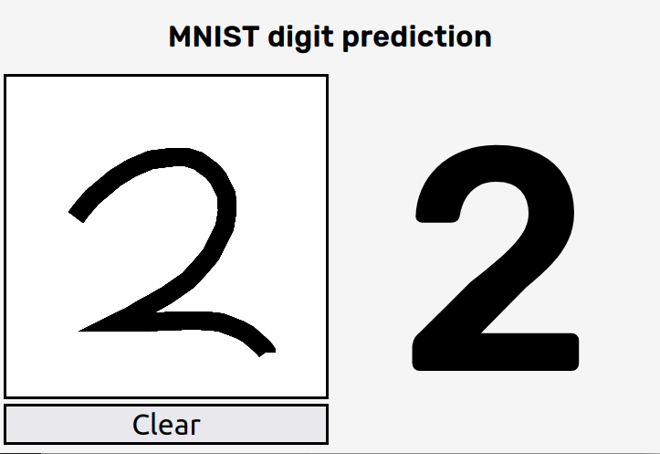

# MNIST classification using SVM models

This is the solution of Exercise 7 and 8 of Chapter 7 of the book
*Hands-On Machine Learning with Scikit-Learn, Keras & Tensorflow*.

It classifies digits between 0 and 9. It is trained using the 
[MNIST dataset from OpenML](https://www.openml.org/d/554).

It also provides a simple web interface for testing the predictions,
which can be run with the following command (make sure to install the
dependencies and generate the model before):

    $ flask run --host=0.0.0.0

and looks like this.

## Install dependencies

Create a virtual environment, activate it and install the
dependencies with

    $ python3 -m venv venv
    $ source ./venv/bin/activate
    $ pip install -r requirements.txt

## TLDR

To generate and train the model use the following commands:

    $ python -m fetch
    $ python -m train -M svm

## Using

You can use the following models from the CLI:

    $ python -m fetch -h
    usage: fetch.py [-h] [-o OUTPATH] [-s] [-r]
    
    Fetch the mnist_784 dataset from openml, and save it to HDF5.
    
    optional arguments:
      -h, --help            show this help message and exit
      -o OUTPATH, --outpath OUTPATH
                            The filepath where the HDF5 dataset will be saved.
      -s, --shift           Augment the dataset by shifting the images.
      -r, --rotate          Augment the dataset by rotating the images.

    $ python3 -m train --help
    usage: train.py [-h] [-g] [-d DATASET] [-o OUTPATH] [-v] [-m] [-V] [-C REGULARIZATION] [-G GAMMA]
                    [-E ESTIMATORS] [-D MAX_DEPTH] [-L LOSS] [-P PENALTY] [-A ALPHA] [-M MODEL]

    Train a model from an HDF5 dataset and export it to a file.

    optional arguments:
      -h, --help            show this help message and exit
      -g, --gridsearch      Perform a grid search for optimizing the hyperparameters. If specified the model
                            hyperparameters (e.g. --gamma and --regularization) are ignored.
      -d DATASET, --dataset DATASET
                            A filepath containing the dataset in the HDF5 format.
      -o OUTPATH, --outpath OUTPATH
                            The filepath for storing the trained model.
      -v, ---verbose        Display information about the trained model on stdout.
      -m, --metrics         Display metrics computed on the test set.
      -V, --validation      Use the validation set to compute the metrics.
      -C REGULARIZATION, --regularization REGULARIZATION
                            Regularization parameter for SVM classifiers. The strength of the regularization is
                            inversely proportional to C. Must be strictly positive. The penalty is a squared l2
                            penalty
      -G GAMMA, --gamma GAMMA
                            Kernel coefficient for 'rbf', 'poly' and 'sigmoid'. Can be a float value or one of
                            'scale' and 'auto'
      -E ESTIMATORS, --estimators ESTIMATORS
                            Number of estimators used for ensemble classifiers. Can be used with Random Forest or
                            Extra Trees classifiers.
      -D MAX_DEPTH, --max_depth MAX_DEPTH
                            Max depth of tree classifiers. Can be used with Random Forest or Extra Trees
                            classifiers.
      -L LOSS, --loss LOSS  The loss function to be used for SGD classifiers. Can be 'hinge', 'log',
                            'modified_huber', 'squared_hinge', 'perceptron', or a regression loss: 'squared_error',
                            'huber', 'epsilon_insensitive', or 'squared_epsilon_insensitive'.
      -P PENALTY, --penalty PENALTY
                            The penalty (aka regularization term) to be used for SGD classifiers. Can be either 'l1'
                            or 'l2'.
      -A ALPHA, --alpha ALPHA
                            Constant that multiplies the regularization term for SGD classifiers. The higher the
                            value, the stronger the regularization.
      -M MODEL, --model MODEL
                            The algorithm to be used for training the model. The following values are allowed: svm,
                            forest, extra, sgd.

    $ python -m predict -h
    usage: predict.py [-h] [-m MODEL] [-v] [images [images ...]]

    Predict an image of a digit between 0 and 9 using an SVM classificator.

    positional arguments:
      images                The filepath of the image to be predicted.

    optional arguments:
      -h, --help            show this help message and exit
      -m MODEL, --model MODEL
                            The filepath of the trained model.
      -v, ---verbose        Display information about the trained model on stdout.

## Performance

    $ python3 -m train -v -m -V -g -M svm
    INFO    Loading dataset from data.h5
    INFO    Performing grid search.
    Fitting 5 folds for each of 8 candidates, totalling 40 fits
    INFO    Search time: 638.58s
    INFO    Search Accuracy: 0.9448000000000001
    INFO    Best parameters: {
      "clf__C": 8,
      "clf__gamma": "auto",
      "clf__kernel": "rbf"
    }

    INFO    Training an svm classifier.
    INFO    Training time: 226.63s
    INFO    Metrics computed on the test set
                  precision    recall  f1-score   support

              0       0.98      0.99      0.99       985
              1       0.99      0.99      0.99      1110
              2       0.97      0.98      0.97      1004
              3       0.98      0.95      0.97      1000
              4       0.96      0.98      0.97       976
              5       0.97      0.96      0.97       897
              6       0.98      0.97      0.98       969
              7       0.94      0.97      0.96      1062
              8       0.97      0.96      0.97       995
              9       0.97      0.96      0.97      1002

        accuracy                           0.97     10000
      macro avg       0.97      0.97      0.97     10000
    weighted avg       0.97      0.97      0.97     10000

    Confusion matrix:
    [[ 974    1    0    1    0    2    4    3    0    0]
    [   1 1096    3    1    1    0    1    5    1    1]
    [   3    1  980    3    2    1    2    9    3    0]
    [   0    0   11  955    0    8    0   14    9    3]
    [   0    4    2    0  958    0    1    2    0    9]
    [   4    0    1   10    1  861    6    5    7    2]
    [   4    1    2    1    3    8  941    6    3    0]
    [   1    6    5    0   10    0    0 1031    1    8]
    [   3    1    3    5    7    3    5    6  960    2]
    [   2    0    6    1   14    1    0   15    2  961]]

    $ python3 -m train -v -m -V -g -M forest
    INFO    Loading dataset from data.h5
    INFO    Performing grid search.
    Fitting 5 folds for each of 9 candidates, totalling 45 fits
    INFO    Search time: 138.69s
    INFO    Search Accuracy: 0.9473999999999998
    INFO    Best parameters: {
      "clf__max_depth": 64,
      "clf__n_estimators": 500,
      "clf__n_jobs": -1
    }

    INFO    Training an forest classifier.
    INFO    Training time: 64.66s
    INFO    Metrics computed on the test set
                  precision    recall  f1-score   support

              0       0.98      0.99      0.98       985
              1       0.98      0.99      0.99      1110
              2       0.97      0.97      0.97      1004
              3       0.96      0.94      0.95      1000
              4       0.97      0.97      0.97       976
              5       0.97      0.96      0.97       897
              6       0.98      0.98      0.98       969
              7       0.97      0.97      0.97      1062
              8       0.96      0.95      0.95       995
              9       0.95      0.95      0.95      1002

        accuracy                           0.97     10000
      macro avg       0.97      0.97      0.97     10000
    weighted avg       0.97      0.97      0.97     10000

    Confusion matrix:
    [[ 975    1    0    0    3    2    1    0    3    0]
    [   1 1099    1    1    2    0    1    4    1    0]
    [   4    2  978    5    2    0    0    4    9    0]
    [   2    1   17  941    1   12    1   12    7    6]
    [   0    2    0    0  951    0    3    2    2   16]
    [   5    0    3    8    0  863    6    0    6    6]
    [   4    0    1    0    1    6  953    0    4    0]
    [   0    5    5    2    7    0    0 1027    3   13]
    [   2    6    5   13    5    2    6    1  945   10]
    [   5    1    1   13   13    1    0    8    7  953]]

    $ python3 -m train -v -m -V -g -M extra
    INFO    Loading dataset from data.h5
    INFO    Performing grid search.
    Fitting 5 folds for each of 9 candidates, totalling 45 fits
    INFO    Search time: 184.75s
    INFO    Search Accuracy: 0.952
    INFO    Best parameters: {
      "clf__max_depth": 64,
      "clf__n_estimators": 500,
      "clf__n_jobs": -1
    }

    INFO    Training an extra classifier.
    INFO    Training time: 78.68s
    INFO    Metrics computed on the test set
                  precision    recall  f1-score   support

              0       0.98      0.99      0.99       985
              1       0.99      0.99      0.99      1110
              2       0.97      0.97      0.97      1004
              3       0.97      0.94      0.96      1000
              4       0.97      0.97      0.97       976
              5       0.98      0.97      0.97       897
              6       0.99      0.99      0.99       969
              7       0.97      0.97      0.97      1062
              8       0.96      0.97      0.96       995
              9       0.95      0.95      0.95      1002

        accuracy                           0.97     10000
      macro avg       0.97      0.97      0.97     10000
    weighted avg       0.97      0.97      0.97     10000

    Confusion matrix:
    [[ 974    1    0    0    3    3    1    0    3    0]
    [   1 1099    2    1    1    0    1    4    1    0]
    [   3    3  976    5    2    0    0    4   11    0]
    [   1    1   17  945    1   11    0   12    9    3]
    [   0    2    0    0  951    0    3    2    1   17]
    [   5    0    2    4    1  869    5    0    6    5]
    [   2    0    0    0    1    5  957    0    4    0]
    [   1    5    4    0    5    0    0 1030    3   14]
    [   1    3    2   10    4    0    3    1  962    9]
    [   3    1    2   13   13    1    0   10    5  954]]

